# The Beard Masters
The Beard Masters is a Professional e-Commerce Barber website that allows users to view Barber services provided. In order for a new user to purchase as service, they must register for their own profile account. After they have registered, they will receive an email to verify their email address. When they verify the email link received, they can then login with their chosen username and password that they have created.

After the user has logged in, they can then add services to their basket, amend quantities, remove items or complete their checkout purchases. They can view and update their checkout items anytime, if they wish to ammend them. The user will submit their payment method and once approved, they will be notified of a success message.

Visit the deployed website: [The Beard Masters](https://thebeardmasters.herokuapp.com/).

## Table of Contents
1. [User Experience (UX)](#user-experience-UX)
    1. [Project Goals](#project-goals)
    2. [User Stories](#user-stories)
    3. [Colour Scheme](#colour-scheme)

2. [Features](#features)
    1. [Current Features](#current-features)
    2. [Future Features](#future-features)
3. [Technologies Used](#technologies-used)
    1. [Language Used](#language-used)
    2. [Programs Used](#programs-used)
    
4. [Testing](#testing)
    1. [Testing User Stories](#testing-user-stories)
    2. [Code Validation](#code-validation)
    3. [Manual Testing](#manual-testing)

5. [Deployment](#deployment)

6. [Cloning & Forking](#cloning)
    1. [Cloning](#cloning)
    2. [Fork](#fork)

7. [Credits](#credits)

8. [Acknowledgements](#acknowledgements)

## User Experience (UX)
### Project Goals
The goal of the website was to design and create an easy-to-use, interactive e-commerce website. Offering users the ability to register for their own account where they can manage their profile, such as profile pic and personal data.

Once the profile is registered and verified, the user can then place service items into their basket, which has a running total. They have the option to update, remove items from their basket. They also have the option to proceed to the checkout. They confirm their delivery details, add payment card details and payment is handled and validated by Stripe.

### User Stories
User Stories are demonstrated in the manual testing section below.

[User Stories](https://github.com/users/gregcotech007/projects/1/)

- As a User, I can view a list of services so that I can select some to purchase.
- As a User, I can view individual services details so that I can choose what suits my needs.
- As a User, I want to be able to quickly identify deals and special offers so that I can take advantage of special savings of products and services I'd like to purchase.
- As a User, I want to be able to book an appointment so that I can schedule an available appointment that suits me.
- As a User, I want to be able to purchase gift voucher(s) so that I can give to my family and friends.
- As a User, I want to be able to easily view the total of my purchases at any time so that I can avoid spending too much.
- As a Site User, I want to be able to register for an account so that I can have a personal account and be able to view my profile.
- As a Site User, I want to be able to easily login and logout so that I can access my personal account information.
- As a Site User, I want to be able to easily recover my password in case I forget it, so that I can recover access to my account.
- As a Site User, I want to be able to receive an email confirmation after registration so that I can verify my account registration was successful.
- As a Site User, I want to be able to have a personalised user profile so that I can view my personal booking and order history, booking and order confirmations and save my payment information.
- As a User, I want to be able to sort a list of available services so that I can easily identify the best rated, best priced and easily categorise the services.
- As a User, I want to be able to sort a specific category of services, so that I can find the best-priced or best-rated service in a specific category, or sort the services in that category by name.
- As a User, I want to be able to search for a service by name or description so that I can find a specific service that I would like to purchase.
- As a User, I want to be able to search for a product by name or description so that I can find a specific product I would like to purchase.
- As a User, I want to be able to easily see what I've searched for and the number of results, so that I can quickly decide whether the service I want is available.
- As a Site Admin, I want to be able to manage services offered, by adding, updating and deleting services so that the all services are up to date and available to book.

### Colour Scheme
[Coolours](https://coolors.co/)
#### Here are the colours being used:

  
Coolers Colour Pallette

    - #000000 - Black
    - #FFFFFF - White

### Typography
[Google Fonts](https://fonts.google.com/) is used across the entire site.
Roboto & Lato are the two fonts that has been chosen to use across the site. 

### Wireframes
Wireframes were created for the different device types as follows:

  
Mobile Wireframe

  

  
Tablet Wireframe

  

  
Desktop Wireframe

  

[Back to top ⇧](#top)

## Features

### Current Features

<table>
    <tr>
        <th>Feature</th>
        <th>Description</th>
    </tr>
    <tr>
        <td>Favicon</td>
        <td>The favicon image was selected as the company logo image. The favicon is visible in the browser tab and search engine history. It adds a unique identifier to the site.</td>
    </tr>
        <tr>
        <td>Homepage</td>
        <td>The Homepage is the landing page that the user will arrive at on the website. It includes an image of an aged bearded male.</td>
    </tr>
    <tr>
        <td>Header</td>
        <td>The header is fixed at the top of the page. It consists of a company logo and links.</td>
    </tr>
    <tr>
        <td>Footer</td>
        <td>The footer also includes the same colour scheme as the header. The footer contains social media links, on-hover over links, the icon increases in size and changes colour to green.</td>
    </tr>
    <tr>
        <td>Site Navigation</td>
        <td>The site navigation bar will change depending on user status. If logged in as a registered user, they will have an option to view and update their profile. If they are logged in as Site Admin, they will have access to booking management also. </td>
    </tr>
    <tr>
        <td>Shopping Basket</td>
        <td>The shopping basket will update with items added or removed and will also calculate the current cost status after each change.</td>
    </tr>
</table>

### Future Features
- Add a list of products to the online store so that the Customer can purchase alongside their services booking and have it shipped or collect instore.
- Add an option to purchase multiple denominations of Gift Cards that can be used online or instore.
- Provide an option to reset forgotten password.

## Technologies Used

### Language Used
* [HTML 5](https://en.wikipedia.org/wiki/HTML5)
* [CSS 3](https://en.wikipedia.org/wiki/CSS)
* [JavaScript](https://en.wikipedia.org/wiki/JavaScript)
* [Python](https://www.python.org/)
* [Django Framework](https://www.djangoproject.com/)

### Programs Used
* [GitPod](https://gitpod.io/) was used for writing code and pushing to main on GitHub.
* [GitHub](https://github.com/) was used to store the project after pushing the code.
* [Coolours](https://coolors.co/) library was used to apply colour to the website. 
* [Balsamiq](https://balsamiq.com/wireframes/) was used to create and design the mobile, tablet and desktop wireframes.

[Back to top ⇧](#top)

## Testing

### Code Validation
[W3C HTML Validation](https://validator.w3.org/#validate_by_input)

[W3C CSS Validation](https://jigsaw.w3.org/css-validator/#validate_by_input)

[CI Python Linter - Pep8](https://pep8ci.herokuapp.com/)

<table>
    <tr>
        <th>Resource Used</th>
        <th>Code Tested</th>
        <th>Example</th>
        <th>Pass/Fail</th>
    </tr>
    <tr>
        <td>W3C CSS Validation</td>
        <td>base.css</td>
        <td>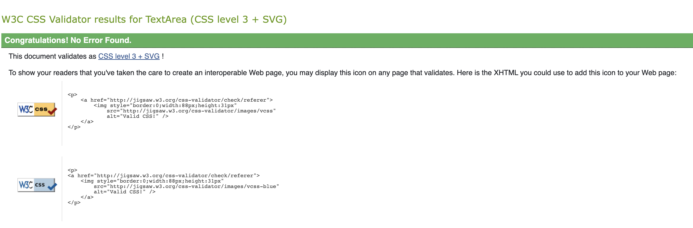</td>
        <td>Pass</td>
    </tr>
    <tr>
        <td>W3C HTML Validation</td>
        <td>home.html</td>
        <td>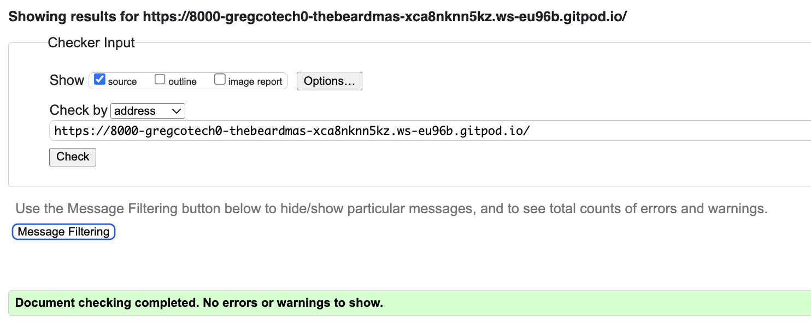</td>
        <td>Pass</td>
    </tr>
    <tr>
        <td>W3C HTML Validation</td>
        <td>our_story.html</td>
        <td>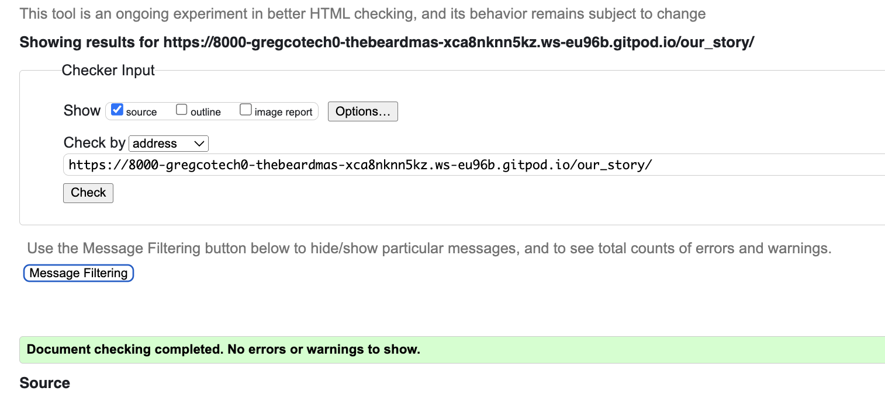</td>
        <td>Pass</td>
    </tr>
    <tr>
        <td>W3C HTML Validation</td>
        <td>Bookings Sort By Price</td>
        <td>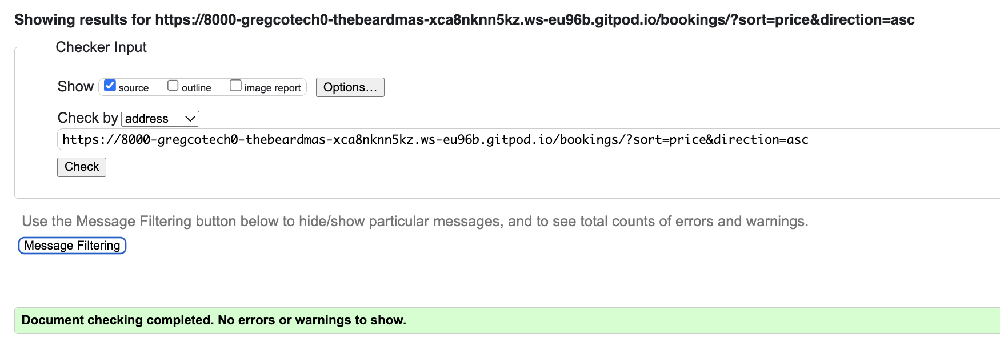</td>
        <td>Pass</td>
    </tr>
    <tr>
        <td>W3C HTML Validation</td>
        <td>Bookings Sort By Rating</td>
        <td>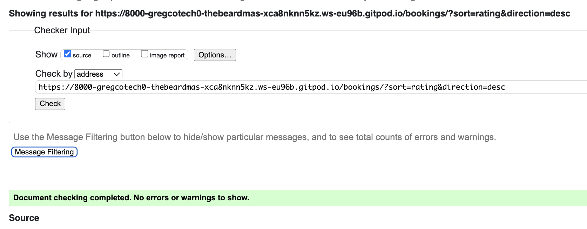</td>
        <td>Pass</td>
    </tr>
    <tr>
        <td>W3C HTML Validation</td>
        <td>Bookings Sort By Category</td>
        <td>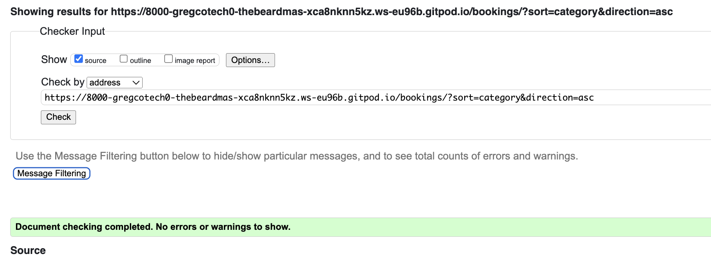</td>
        <td>Pass</td>
    </tr>
    <tr>
        <td>W3C HTML Validation</td>
        <td>Bookings - All Bookings</td>
        <td>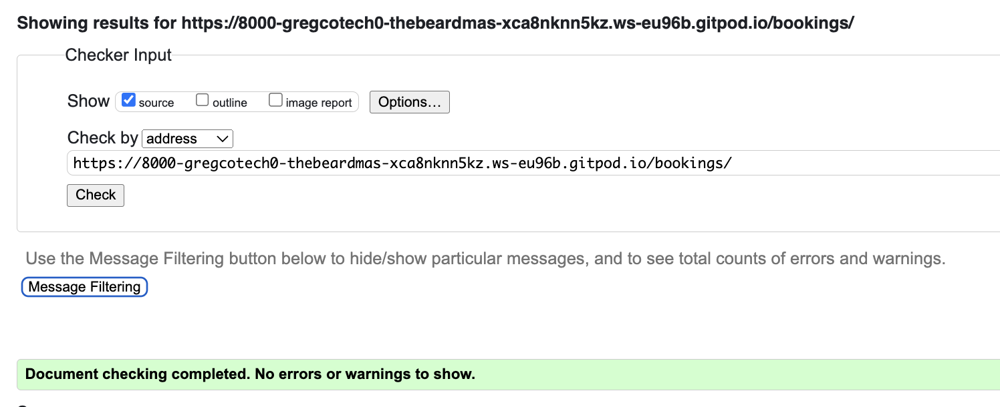</td>
        <td>Pass</td>
    </tr>
    <tr>
        <td>W3C HTML Validation</td>
        <td>Filter By Adult</td>
        <td>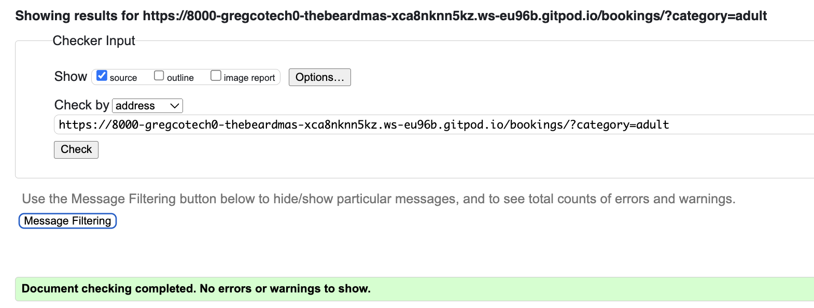</td>
        <td>Pass</td>
    </tr>
    <tr>
        <td>W3C HTML Validation</td>
        <td>Filter By OAP / Student</td>
        <td>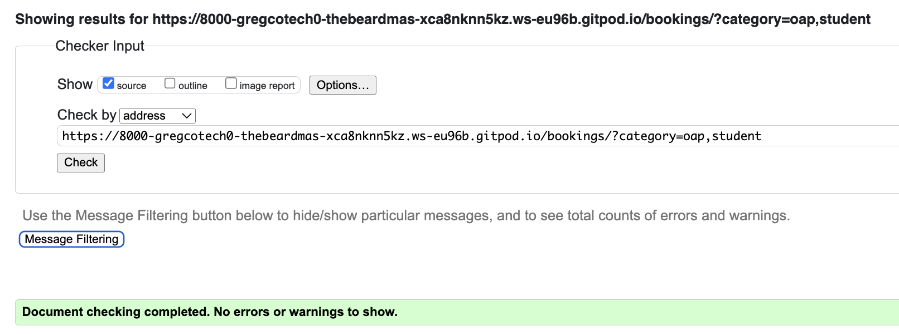</td>
        <td>Pass</td>
    </tr>
    <tr>
        <td>W3C HTML Validation</td>
        <td>Filter By Child</td>
        <td>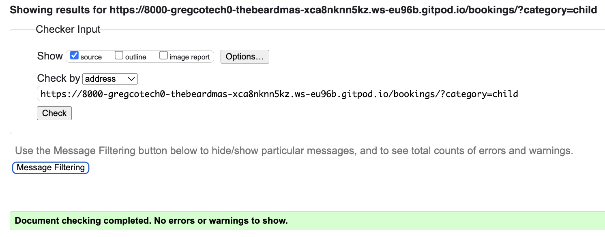</td>
        <td>Pass</td>
    </tr>
    <tr>
        <td>W3C HTML Validation</td>
        <td>Filter By All Filters</td>
        <td>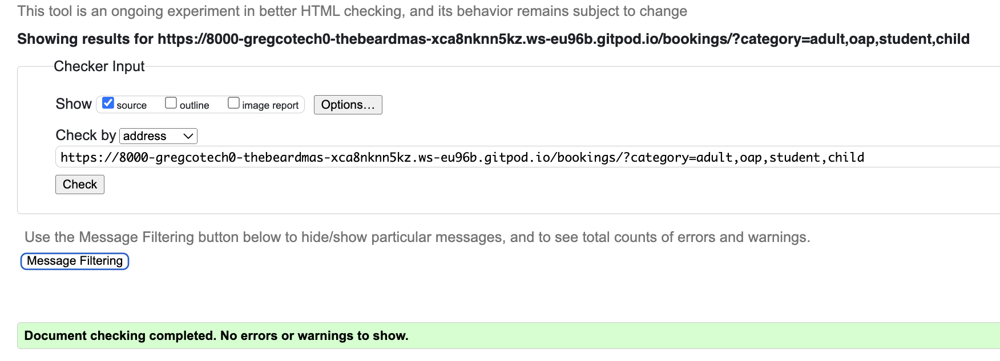</td>
        <td>Pass</td>
    </tr>
    <tr>
        <td>W3C HTML Validation</td>
        <td>Account Signup</td>
        <td>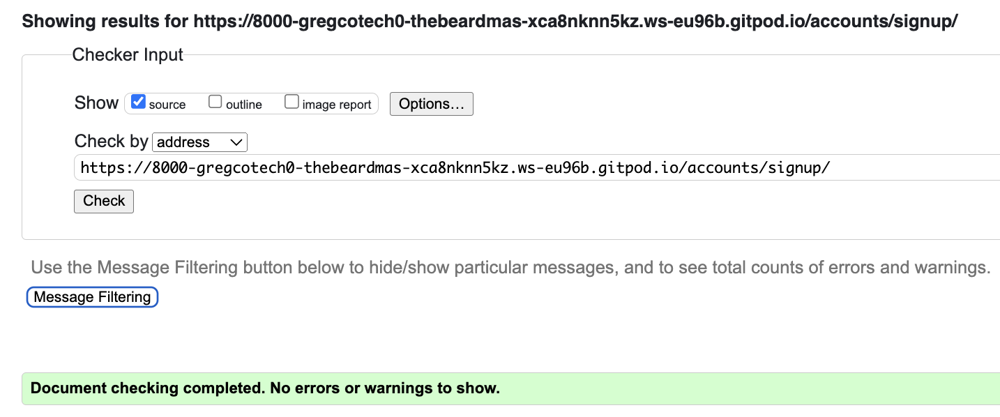</td>
        <td>Pass</td>
    </tr>
    <tr>
        <td>W3C HTML Validation</td>
        <td>Account Login</td>
        <td></td>
        <td>Pass</td>
    </tr>
    <tr>
        <td>W3C HTML Validation</td>
        <td>Account Logout</td>
        <td></td>
        <td>Pass</td>
    </tr>
    <tr>
        <td>Pep8 Validator</td>
        <td>bag/context.py</td>
        <td></td>
        <td>Pass</td>
    </tr>
    <tr>
        <td>Pep8 Validator</td>
        <td>bag/urls.py</td>
        <td>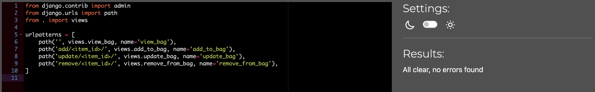</td>
        <td>Pass</td>
    </tr>
    <tr>
        <td>Pep8 Validator</td>
        <td>bag/views.py</td>
        <td></td>
        <td>Pass</td>
    </tr>
    <tr>
        <td>Pep8 Validator</td>
        <td>beardmasters/urls.py</td>
        <td>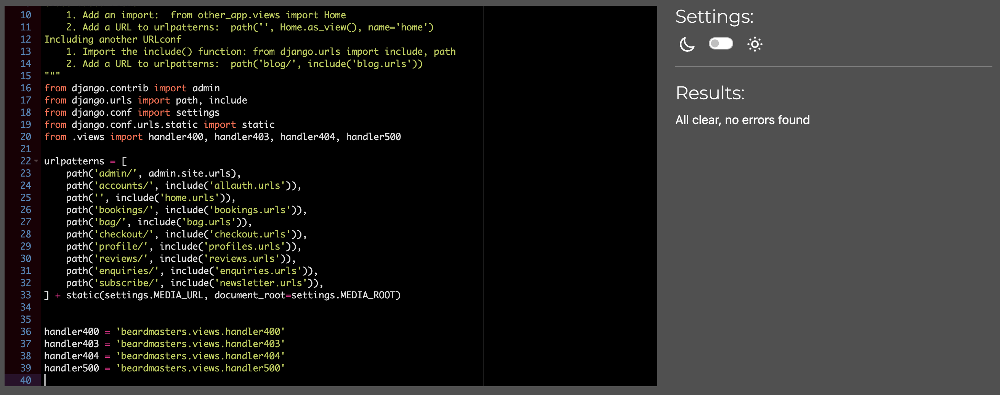</td>
        <td>Pass</td>
    </tr>
    <tr>
        <td>Pep8 Validator</td>
        <td>beardmasters/views.py</td>
        <td>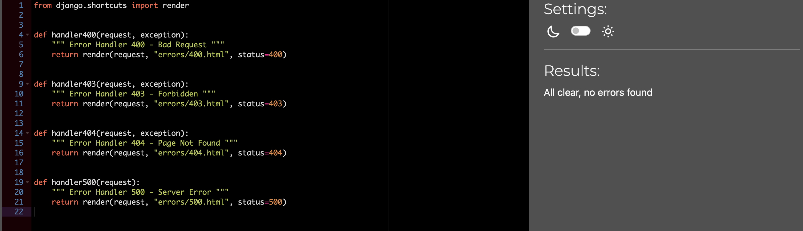</td>
        <td>Pass</td>
    </tr>
    <tr>
        <td>Pep8 Validator</td>
        <td>bookings/admin.py</td>
        <td>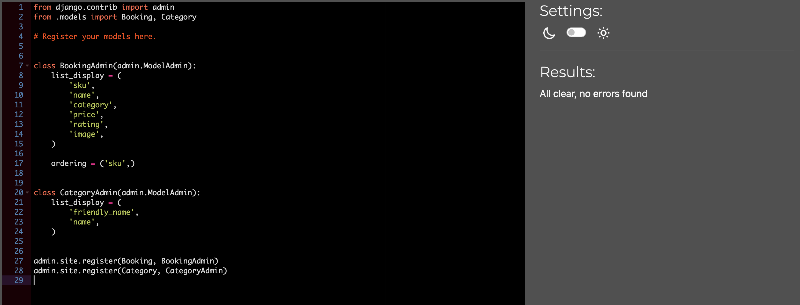</td>
        <td>Pass</td>
    </tr>
    <tr>
        <td>Pep8 Validator</td>
        <td>bookings/apps.py</td>
        <td>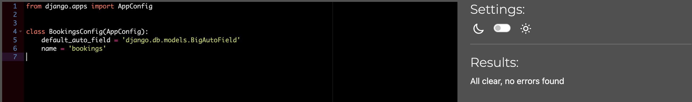</td>
        <td>Pass</td>
    </tr>
    <tr>
        <td>Pep8 Validator</td>
        <td>bookings/forms.py</td>
        <td>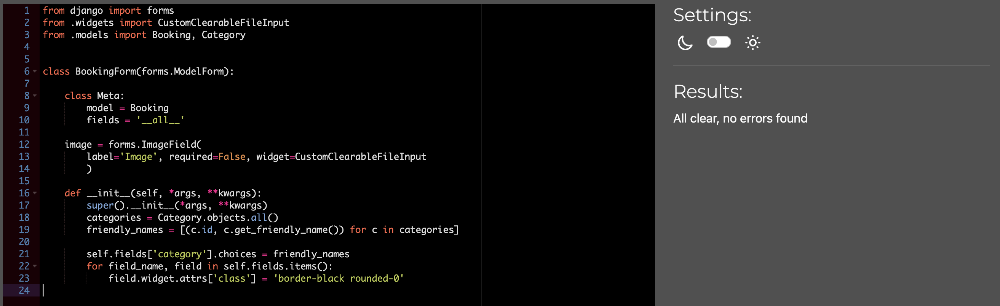</td>
        <td>Pass</td>
    </tr>
    <tr>
        <td>Pep8 Validator</td>
        <td>bookings/models.py</td>
        <td>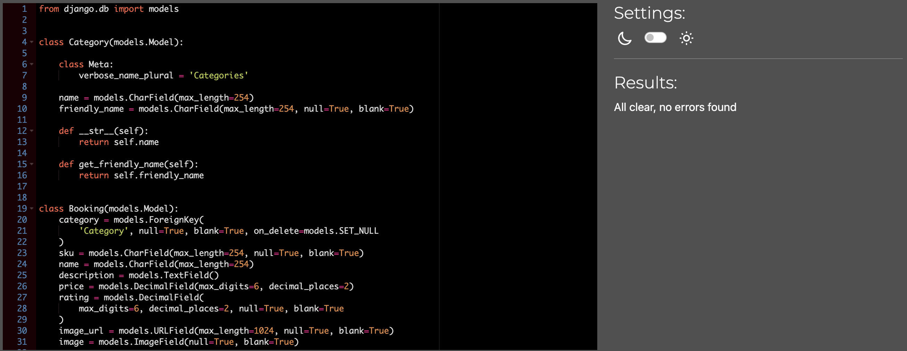</td>
        <td>Pass</td>
    </tr>
    <tr>
        <td>Pep8 Validator</td>
        <td>bookings/urls.py</td>
        <td>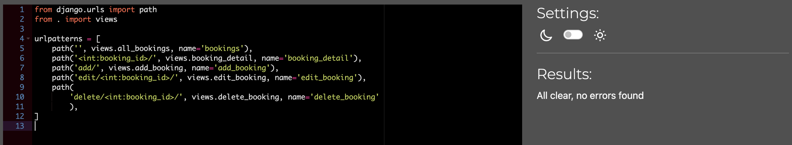</td>
        <td>Pass</td>
    </tr>
    <tr>
        <td>Pep8 Validator</td>
        <td>bookings/views.py</td>
        <td>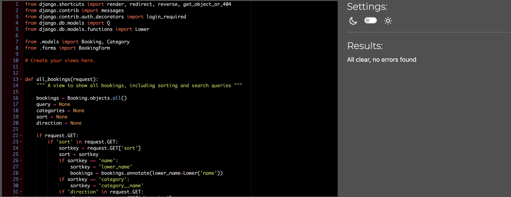</td>
        <td>Pass</td>
    </tr>
    <tr>
        <td>Pep8 Validator</td>
        <td>bookings/widgets.py</td>
        <td>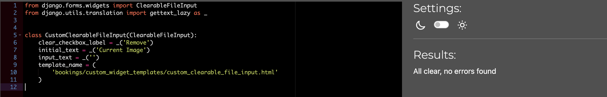</td>
        <td>Pass</td>
    </tr>
    <tr>
        <td>Pep8 Validator</td>
        <td>checkout/admin.py</td>
        <td>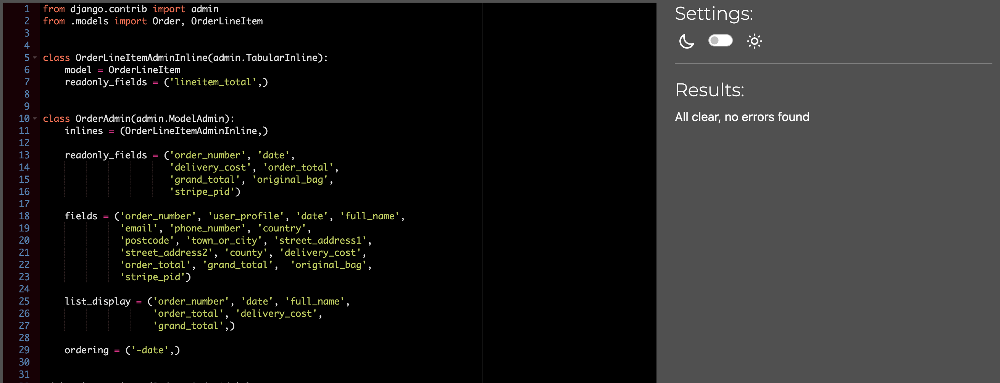</td>
        <td>Pass</td>
    </tr>
    <tr>
        <td>Pep8 Validator</td>
        <td>checkout/forms.py</td>
        <td>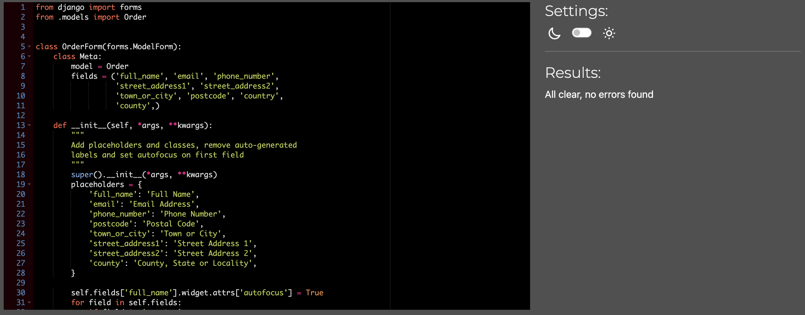</td>
        <td>Pass</td>
    </tr>
    <tr>
        <td>Pep8 Validator</td>
        <td>checkout/models.py</td>
        <td>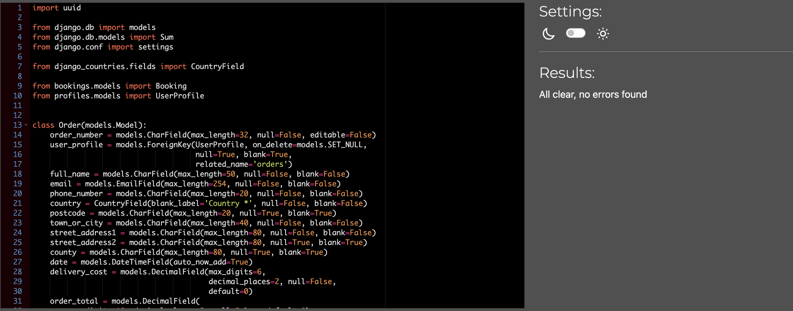</td>
        <td>Pass</td>
    </tr>
    <tr>
        <td>Pep8 Validator</td>
        <td>checkout/signals.py</td>
        <td>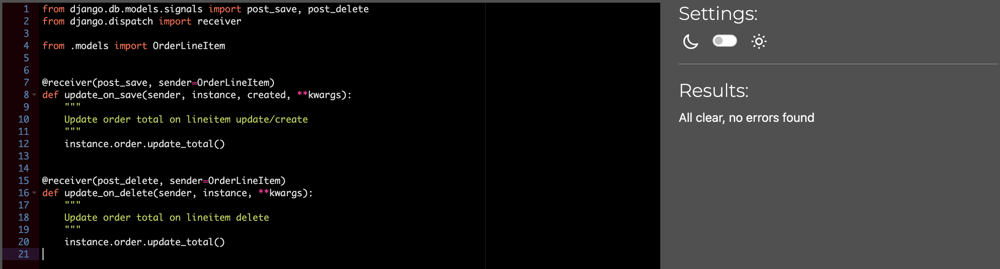</td>
        <td>Pass</td>
    </tr>
    <tr>
        <td>Pep8 Validator</td>
        <td>checkout/urls.py</td>
        <td>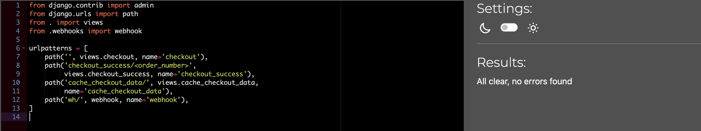</td>
        <td>Pass</td>
    </tr>
    <tr>
        <td>Pep8 Validator</td>
        <td>checkout/views.py</td>
        <td>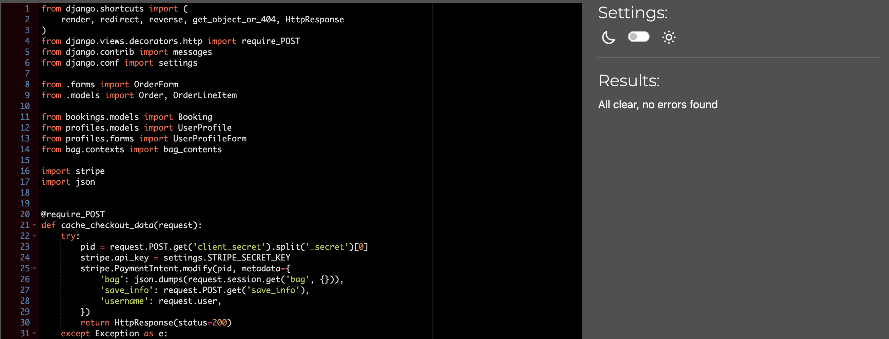</td>
        <td>Pass</td>
    </tr>
    <tr>
        <td>Pep8 Validator</td>
        <td>checkout/webhooks_handler.py</td>
        <td>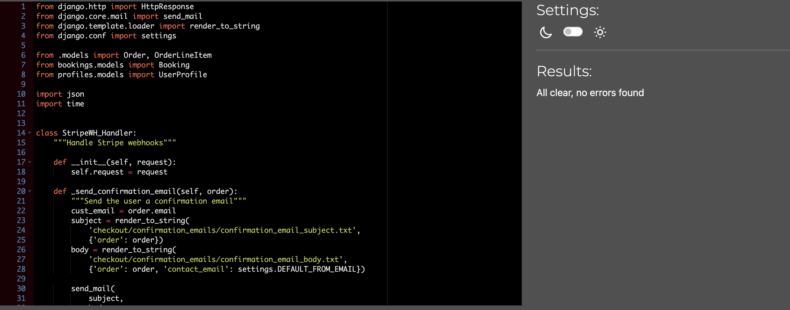</td>
        <td>Pass</td>
    </tr>
    <tr>
        <td>Pep8 Validator</td>
        <td>checkout/webhooks.py</td>
        <td>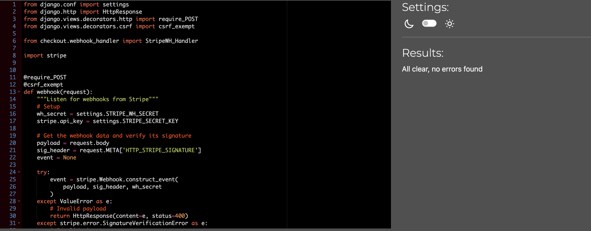</td>
        <td>Pass</td>
    </tr>
    <tr>
        <td>Pep8 Validator</td>
        <td>enquiries/admin.py</td>
        <td>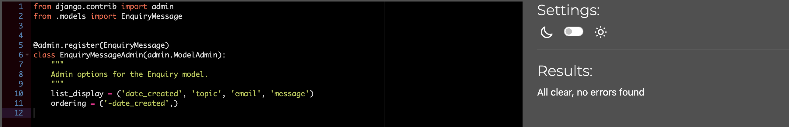</td>
        <td>Pass</td>
    </tr>
    <tr>
        <td>Pep8 Validator</td>
        <td>enquiries/summary_emails.py</td>
        <td>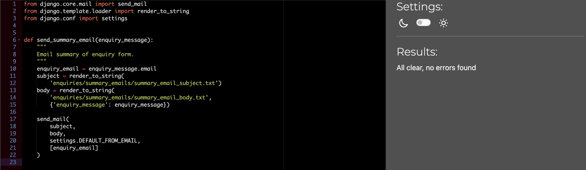</td>
        <td>Pass</td>
    </tr>
    <tr>
        <td>Pep8 Validator</td>
        <td>enquiries/views.py</td>
        <td>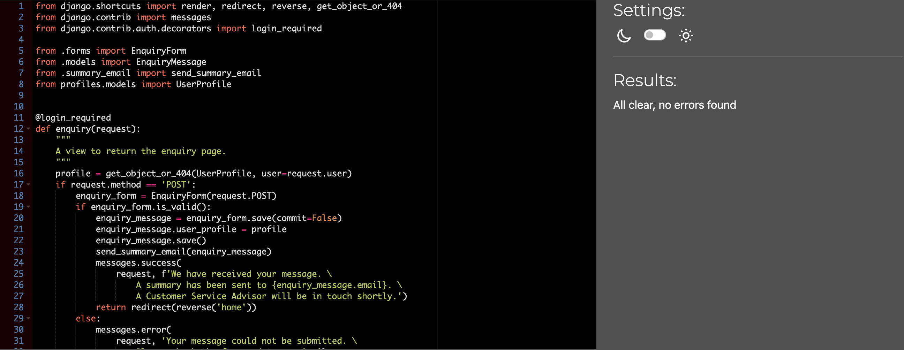</td>
        <td>Pass</td>
    </tr>
    <tr>
        <td>Pep8 Validator</td>
        <td>home/views.py</td>
        <td>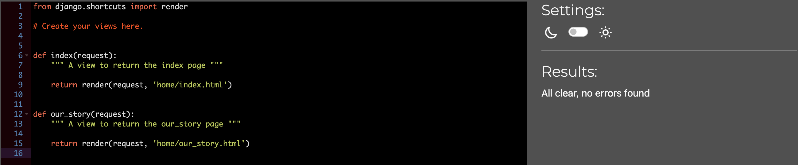</td>
        <td>Pass</td>
    </tr>
    <tr>
        <td>Pep8 Validator</td>
        <td>newsletter/forms.py</td>
        <td>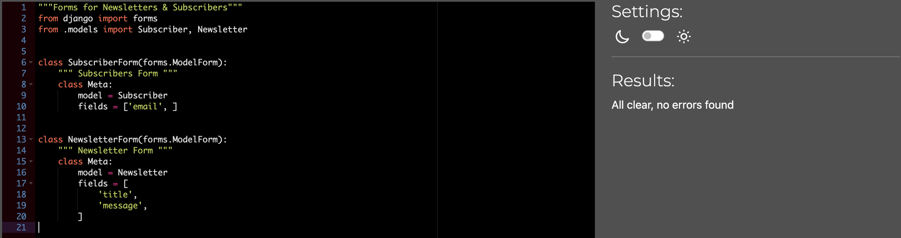</td>
        <td>Pass</td>
    </tr>
    <tr>
        <td>Pep8 Validator</td>
        <td>newsletter/urls.py</td>
        <td>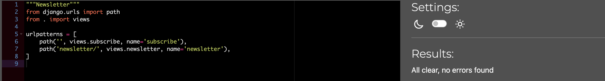</td>
        <td>Pass</td>
    </tr>
    <tr>
        <td>Pep8 Validator</td>
        <td>newsletter/views.py</td>
        <td>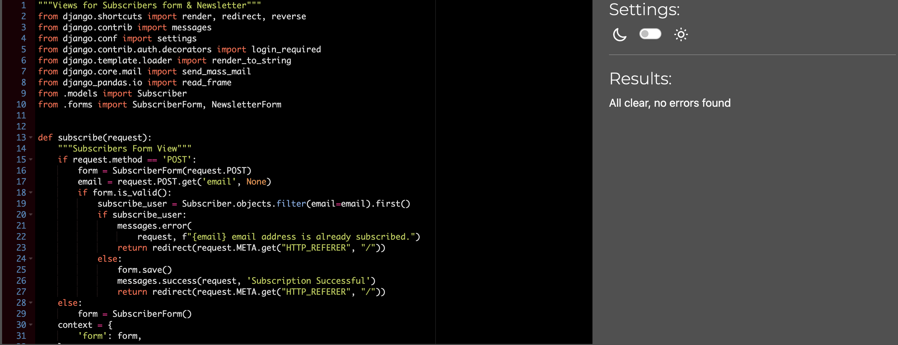</td>
        <td>Pass</td>
    </tr>
    <tr>
        <td>Pep8 Validator</td>
        <td>profiles/forms.py</td>
        <td>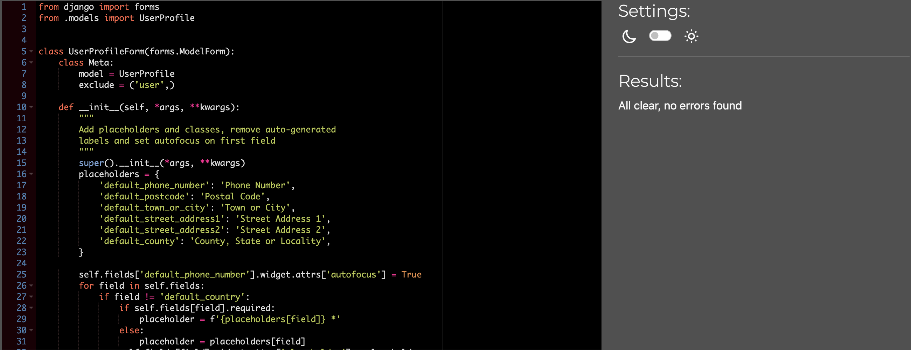</td>
        <td>Pass</td>
    </tr>
    <tr>
        <td>Pep8 Validator</td>
        <td>profiles/models.py</td>
        <td>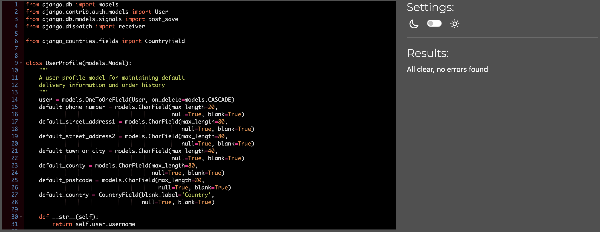</td>
        <td>Pass</td>
    </tr>
    <tr>
        <td>Pep8 Validator</td>
        <td>profiles/urls.py</td>
        <td>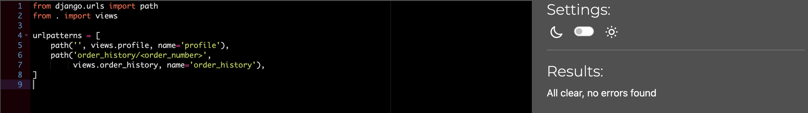</td>
        <td>Pass</td>
    </tr>
    <tr>
        <td>Pep8 Validator</td>
        <td>profiles/views.py</td>
        <td>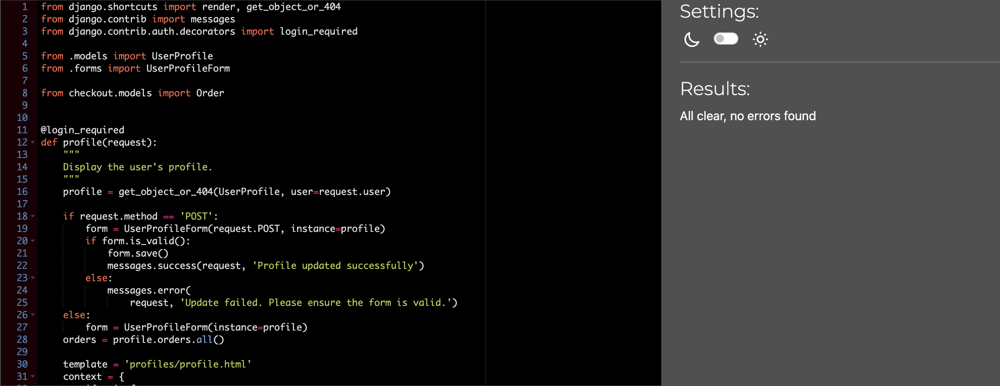</td>
        <td>Pass</td>
    </tr>
    <tr>
        <td>Pep8 Validator</td>
        <td>reviews/admin.py</td>
        <td>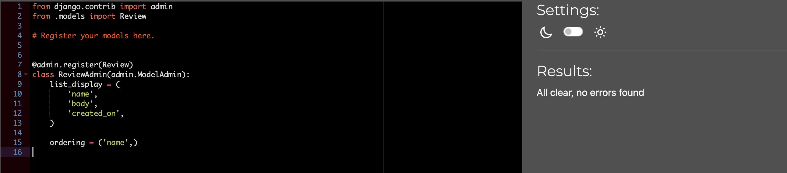</td>
        <td>Pass</td>
    </tr>
    <tr>
        <td>Pep8 Validator</td>
        <td>reviews/urls.py</td>
        <td>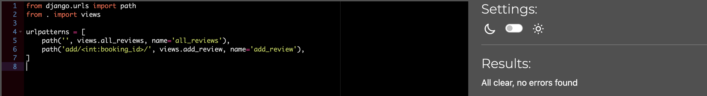</td>
        <td>Pass</td>
    </tr>
    <tr>
        <td>Pep8 Validator</td>
        <td>reviews/views.py</td>
        <td>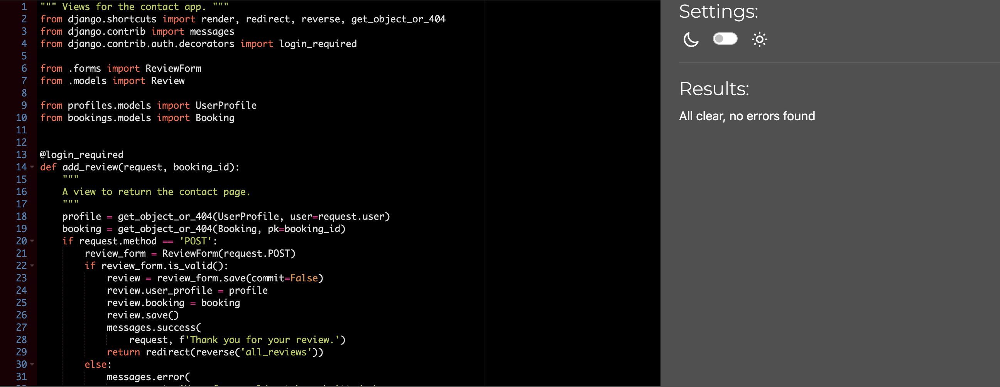</td>
        <td>Pass</td>
    </tr>
</table>

[Back to top ⇧](#top)

### Lighthouse Testing
The site was also tested for the Lighthouse Performance Score and the results were as follows:

  
Lighthouse Testing - Mobile

  

  
Lighthouse Testing - Desktop

  

[Back to top ⇧](#top)

### Manual Testing
<table>
    <tr>
        <th>Feature Tested</th>
        <th>Testing Method</th>
        <th>Example</th>
        <th>Pass/Fail</th>
    </tr>
    <tr>
        <td>Homepage</td>
        <td>Enter homepage address in browser and test all links</td>
        <td></td>
        <td>Pass</td>
    </tr>
    <tr>
        <td>Our Story</td>
        <td>A page displays information about the company story</td>
        <td>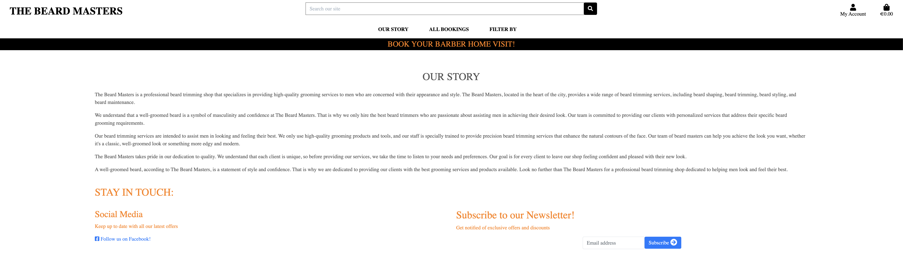</td>
        <td>Pass</td>
    </tr>
    <tr>
        <td>Registration - Blank Fields</td>
        <td>Submit form with blank fields.</td>
        <td>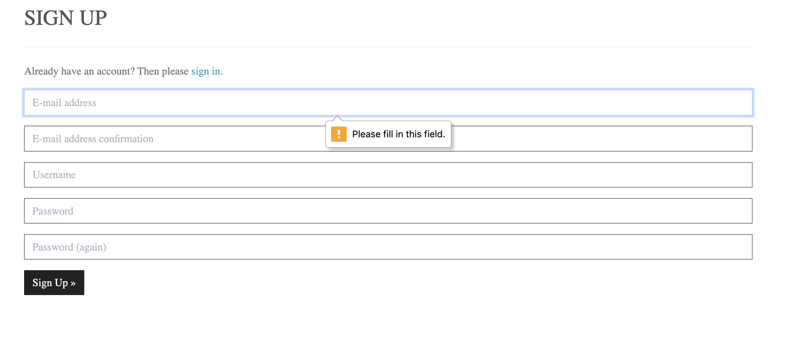</td>
        <td>Pass</td>
    </tr>
    <tr>
        <td>Registration - Invalid Email Field</td>
        <td>User email already registered.</td>
        <td>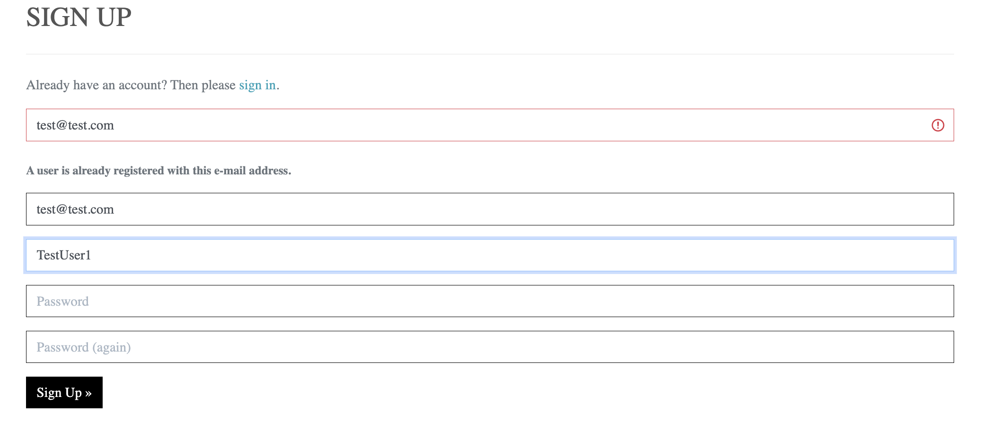</td>
        <td>Pass</td>
    </tr>
    <tr>
        <td>Registration - Common Password</td>
        <td>A common password was tested to check security.</td>
        <td>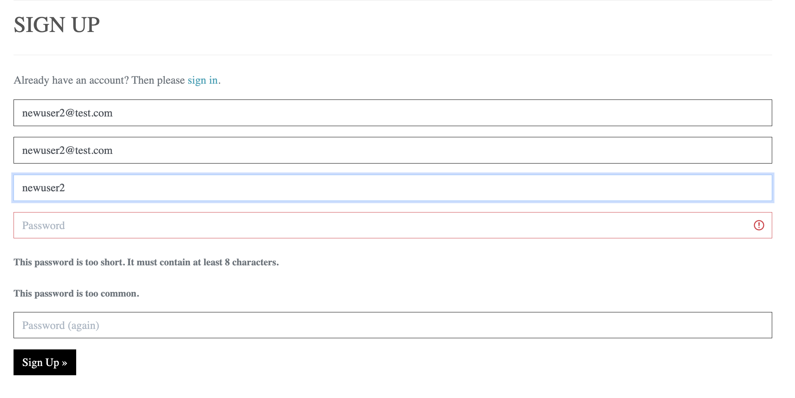</td>
        <td>Pass</td>
    </tr>
    <tr>
        <td>Registration - Email Similiar to Username</td>
        <td>An email that is similiar to username was tested for error message.</td>
        <td>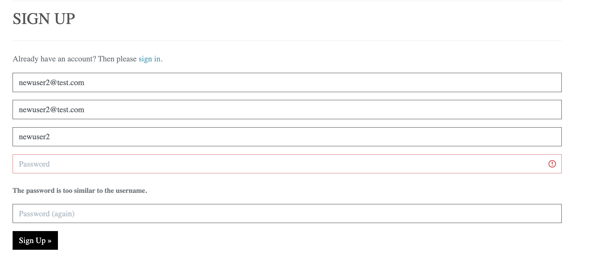</td>
        <td>Pass</td>
    </tr>
    <tr>
        <td>Registration - Signup Successful - Verify Email</td>
        <td>Registration Signup was successful. Toast shows Success Message.</td>
        <td>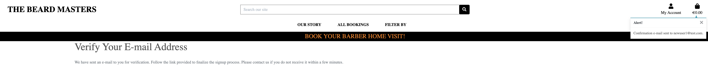</td>
        <td>Pass</td>
    </tr>
    <tr>
        <td>Login - Incorrect Username or Password</td>
        <td>Incorrect password was tested for error message.</td>
        <td>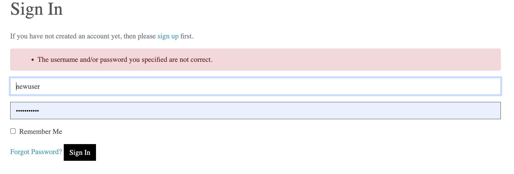</td>
        <td>Pass</td>
    </tr>
    <tr>
        <td>My Account - Update Profile Information</td>
        <td>View My Account options to View Profile or Logout of account.</td>
        <td></td>
        <td>Pass</td>
    </tr>
    <tr>
        <td>My Account - Update Profile Information</td>
        <td>Add User Information to update and save to User Profile.</td>
        <td>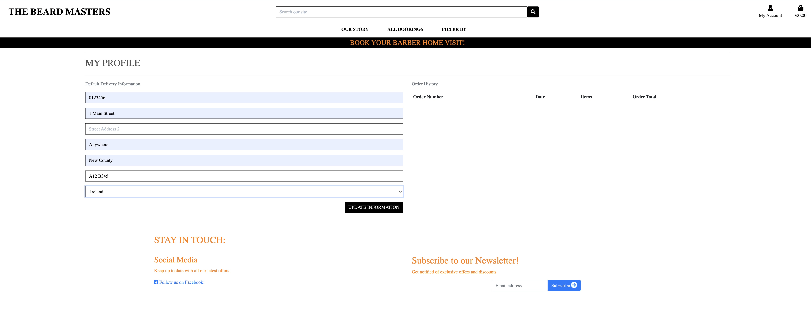</td>
        <td>Pass</td>
    </tr>
    <tr>
        <td>My Account - User Profile Update Success</td>
        <td>Confirmation of User Profile update success with Success Toast.</td>
        <td>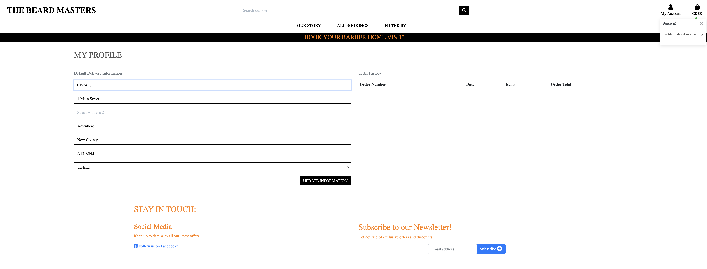</td>
        <td>Pass</td>
    </tr>
    <tr>
        <td>All Bookings - By Price</td>
        <td>Sort All Bookings by Price in Ascending Order</td>
        <td></td>
        <td>Pass</td>
    </tr>
    <tr>
        <td>All Bookings - By Rating</td>
        <td>Sort All Bookings by Rating in Desending Order</td>
        <td></td>
        <td>Pass</td>
    </tr>
    <tr>
        <td>All Bookings - By Category</td>
        <td>Sort All Bookings by Category</td>
        <td></td>
        <td>Pass</td>
    </tr>
    <tr>
        <td>All Bookings - All Bookings</td>
        <td>Show All Bookings</td>
        <td></td>
        <td>Pass</td>
    </tr>
    <tr>
        <td>Filter By - Adult</td>
        <td>Filter Bookings by Adult</td>
        <td></td>
        <td>Pass</td>
    </tr>
    <tr>
        <td>Filter By - OAP/Student</td>
        <td>Filter Bookings by Adult</td>
        <td>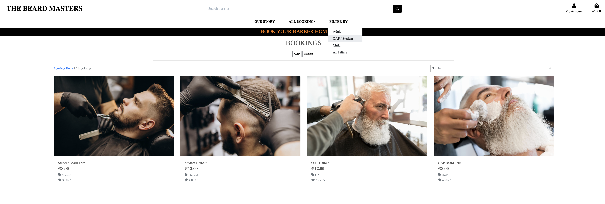</td>
        <td>Pass</td>
    </tr>
    <tr>
        <td>Filter By - Child</td>
        <td>Filter Bookings by Adult</td>
        <td>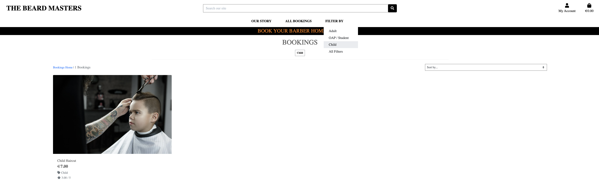</td>
        <td>Pass</td>
    </tr>
    <tr>
        <td>Filter By - All Filters</td>
        <td>Show Bookings by All Filters</td>
        <td></td>
        <td>Pass</td>
    </tr>
    <tr>
        <td>Shopping Bag</td>
        <td>Show Bookings by All Filters</td>
        <td>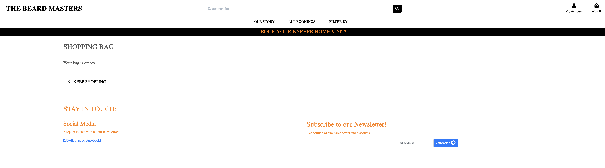</td>
        <td>Pass</td>
    </tr>
</table>

<table>
    <tr>
        <th>Booking Order</th>
        <th>Step Completed</th>
        <th>Image Result</th>
        <th>Pass/Fail</th>
    </tr>
    <tr>
        <td>Homepage</td>
        <td>Step 1: Go to homepage</td>
        <td></td>
        <td>Pass</td>
    </tr>
    <tr>
        <td>Login</td>
        <td>Step 2: Go to Account Login Page</td>
        <td>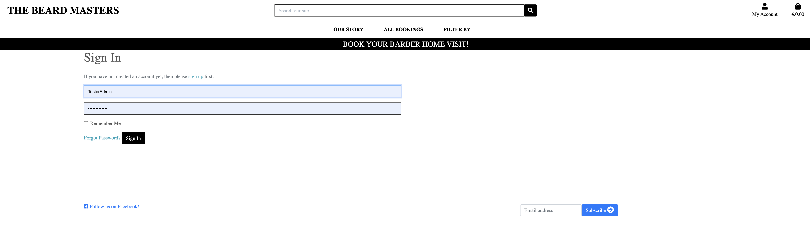</td>
        <td>Pass</td>
    </tr>
    <tr>
        <td>My Account</td>
        <td>Step 3: My Account Page</td>
        <td></td>
        <td>Pass</td>
    </tr>
    <tr>
        <td>All Services Booking</td>
        <td>Step 4: Show All Services Booking Page</td>
        <td></td>
        <td>Pass</td>
    </tr>
    <tr>
        <td>Shopping Bag</td>
        <td>Step 5: Show current item added to Shopping Bag</td>
        <td>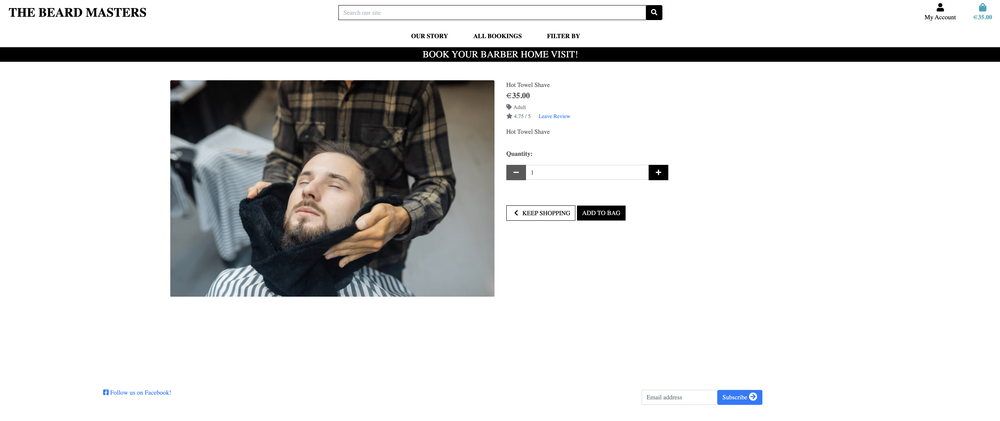</td>
        <td>Pass</td>
    </tr>
    <tr>
        <td>Shopping Bag Checkout</td>
        <td>Step 6: Show Shopping Bag Checkout Items</td>
        <td>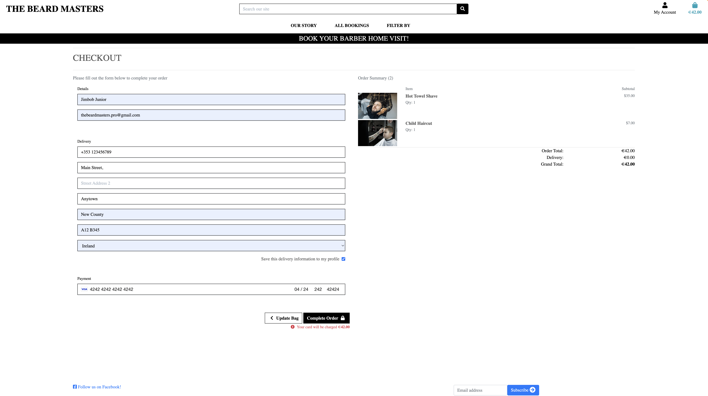</td>
        <td>Pass</td>
    </tr>
    <tr>
        <td>Order Complete Confirmation</td>
        <td>Step 7: Show Order Complete Confirmation</td>
        <td>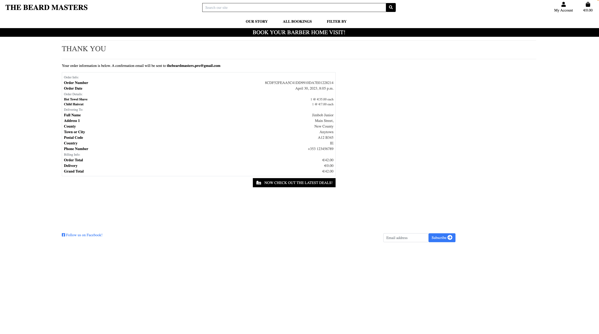</td>
        <td>Pass</td>
    </tr>
    <tr>
        <td>Account Signout</td>
        <td>Step 8: Confirm to Sign Out of Account </td>
        <td>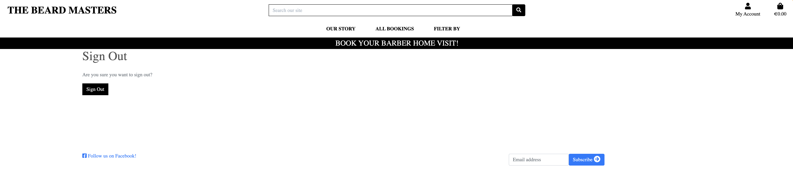</td>
        <td>Pass</td>
    </tr>
</table>

[Back to top ⇧](#top)

## Deployment

### GitHub
The website has been deployed using GitHub Pages by following these steps:
1. Confirmed that correct repository name is selected as: 'thebeardmasters'
2. Select 'Settings'
3. Scroll down to 'GitHub Pages' and click on 'Check it out here!'
4. On the 'Source' section, select Branch as 'main' and click on 'Save'.
5. Your site is published at https://thebeardmasters.herokuapp.com/

### Gitpod
1. For deployment of the website to a local environment, the following steps were required:
2. Confirmed that correct repository is selected as 'thebeardmasters'
3. To run a new Python server, open a terminal window and type the following code and hit enter:
    - python3 mange.py runserver
4. Once the Python server is running, you will be prompted to open a browser on port 8000 to show the output.

### Heroku App Setup
- Choose Create New App by clicking the New button in the top right corner of the Heroku dashboard. 
- Give your app a name (it must be original), choose your local area, and then click the Create App button in the bottom left corner. 
- On the settings tab, add a new configuration variable named DATABASE URL, and then paste the database URL you copied from elephantSQL into its value (the value should not have quotation marks around it).

### Deployment Preparation
- Install psycopg2 and dj database url in order to connect to the newly built external database. 
- Update requirements.txt file
- Under import os in settings.py, add import dj_database_url 
- Find the DATABASES section and remove the code comments. Add the following code after the commented-out portion, and for the value, use the URL you copied from elephantSQL: 
DATABASES = { 
   'default': dj_database_url.parse("elephantsql-db-url") 
} 

- Use the show migrations command in the terminal to verify that you are connected to the external database. 
    manage.py in Python 3 showmigrations
- A list of unchecked migrations will appear if it is connected to the database.
- To move the models to the new database, execute migrations now: 
    manage.py migrate in Python3

For the new database, create a superuser. 
    python3 manage.py createsuperuser 
    When prompted, enter your username, password and email address. 
- In settings.py, you can now add an if/else line for the databases so that you can utilise the development database when developing the site and an external database when it goes live.
if 'DATABASE_URL' in os.environ: 
    DATABASES = { 
        'default': dj_database_url.parse(os.environ.get('DATABASE_URL')) 
    } 
else: 
    DATABASES = { 
        'default': { 
            'ENGINE': 'django.db.backends.sqlite3', 
            'NAME': os.path.join(BASE_DIR, 'db.sqlite3'), 
        } 
    } 
 

- Install the web server gunicorn, which will serve as ours, and add this to the requirements.txt file. 
    pip3 install freeze pip3 gunicorn > requirements.txt 
- In the root directory, create a Procfile. This informs Heroku to create a web dyno that runs Gunicorn and serves our Django application.
- Include the code below in the procfile web: gunicorn beardmasters.wsgi:application
- To disable collectstatic, enter the following command into the heroku config terminal:
    set DISABLE_COLLECTSTATIC=1 --app heroku --insert-name-of-app-here
- Add the following code to settings.py to add the Heroku app and localhost.py
    ALLOWED_HOSTS = ['Heroku deployed site URL here', 'localhost']
- Save, add, commit and push the changes to GitHub.

### Generate a SECRET KEY 
- When you begin a Django project, a secret key is generated right away. However, we shouldn't use this key in the deployed version because it makes our website vulnerable.
- We can generate a new SECRET_KEY or by using a random number generator and then add to our Heroku configuration variables to safeguard the key.
- In the Heroku settings, add a new configuration variable with the key SECRET KEY.
- Update the settings.py, SECRET_KEY = os.environ.get('SECRET_KEY', '') 
- DEBUG = 'DEVELOPMENT' in os.environ
- Save, add, commit and push the changes to GitHub.

### Setting up AWS 
- Sign up for an AWS account or log in using the manage my account link in the top right corner of the page. 
- Next, go to S3 and create a new bucket. Our project files will be kept in this bucket.
- Pick the area that is closest to you.
- In the object ownership area, you must first select ACLs enabled and then bucket owner preferred.
- Click the acknowledge button to make the bucket public. 
- Uncheck the block public access box under the block public access section. Click create bucket after that.
- From the bucket you just established, click the properties tab. 
- Navigate to the static web hosting section, and then select Enable static web hosting.
- Type index.html and error.html for the index and error documents.
- Copy the ARN (Amazon Resource Name) from the permissions tab.
- Select Edit, then Policy Generator under the Bucket Policy section.
- We want to allow all principles, therefore we'll add a * to the input, and the actions will be get object. The policy type will be S3 bucket policy.
- After pasting the ARN we copied from the previous page into the ARN input, click "add statement".
- Copy the policy that appears after selecting "generate policy" in a new pop-up window.
- Make the following adjustments after pasting this policy into the bucket policy editor: At the end of the resource value, add a /*. Select "Save."
- Modify the section for the access control list (ACL). Accept the warning box and click edit to enable the list for everyone (public access).

### Setting up AWS Groups, Policies and Users 
- Go to IAM by selecting the services symbol in the top right corner of the page to manage access to AWS services. From the left-hand navigation menu, select User Groups. Next, press the Create Group button in the top-right corner. This will define the group that our user will be a part of. 
- Select a name for your group and press the right-hand create policy button. It will launch a fresh page.
- After choosing the JSON tab, click the link in the top right corner of the page to import managed policy.
- Click import after conducting a search for S3 and choosing the AmazonS3FullAccess option.
- Select "next: tags" and then "next: review"
- Name and describe the policy (e.g., ‘thebeardmasters-policy | Access to S3 bucket for static files related to beachside stitching). Select "Create Policy" from the menu.
- Click User Groups on the left-hand navigation menu, choose the group, and then click the Permissions tab to attach a policy.
- After clicking the add permissions button on the right, choose "attach policies" from the dropdown menu.
- After selecting the newly generated policy, click Add Permissions at the bottom.
- By selecting the user link in the left-hand navigation menu, you can add a user to the group.
- Select the "Add Users" option in the upper right corner and enter the username for our user (for example, "‘thebeardmasters-staticfiles-user"). 
- Select Programmatic access, then select Permissions from the menu that appears.
- Include the user in the group you just created, then select Next:Tags, Next:Review, and Create User from the menus.
- You must now download the CSV file since we need to add the user access key and secret access key to the Heroku configuration variables. Make sure to download the CSV now because you won't be able to access it again.

### Installing and connecting Django to our S3 bucket 
- Install boto3 and django storages 
pip3 install boto3
    pip3 install django-storages
- freeze them to the requirements.txt file
    pip3 freeze > requirements.txt
- Add storages to the installed apps in settings.py
- To deploy to Heroku, save everything, add, commit, and push these modifications.
- Find S3 and open your bucket there. 
- Press the top right create folder button, then give the folder a name like media. All of our media files will be saved here.

### Stripe Setup 
- Log in and select Developers, followed by API Keys.
- Copy the secret key (STRIPE_SECRET_KEY) and the publishable key (STRIPE_PUBLIC_KEY). 
- Log into Heroku and create 2 new variables in Heroku's configuration variables. The publishable key should be STRIPE_PUBLIC_KEY and the secret key should be STRIPE_SECRET_KEY.
- Click the WebHooks link in the menu on the left and choose the add endpoint option to add webhooks.
- Add the WebHook URL for the deployed sites, describe it, and then click the "add events" button, selecting "all events." To create an endpoint, click.
- Add the WebHook signing secret as STRIPE_WH_SECRET to our Heroku configuration variables.
- Add the subsequent code to settings.py 
    STRIPE_PUBLIC_KEY = os.getenv('STRIPE_PUBLIC_KEY', '') 
    STRIPE_SECRET_KEY = os.getenv('STRIPE_SECRET_KEY', '') 
    STRIPE_WH_SECRET = os.getenv('STRIPE_WH_SECRET', '') 

[Back to top ⇧](#top)

## Cloning
To clone a copy of the code in the repository, the following steps are required:
- Go to https://github.com and select the Repository called ‘thebeardmasters'
- Click on the button called 'Code" and a pop-out window will show options to Clone through:
    - HTTPS
    - SSH
    - GitHub CLI
1. On GitHub.com, navigate to the main page of the repository.
2. Above the list of files, click  Code.
3. To clone the repository using HTTPS, under "Clone with HTTPS", click 'Clipboard to copy'. To clone the repository using an SSH key, including a certificate issued by your organization's SSH certificate authority, click Use SSH, then click 'Clipboard to copy'. To clone a repository using GitHub CLI, click Use GitHub CLI, then click 'Clipboard to copy'.
4. Open Terminal.
5. Change the current working directory to the location where you want the cloned directory.
6. Type > git clone and then paste the URL you copied earlier. 
    > $ git clone https://github.com/YOUR-USERNAME/YOUR-REPOSITORY
7. Press Enter to create your local clone.
    > $ git clone https://github.com/YOUR-USERNAME/YOUR-REPOSITORY
    > Cloning into `Spoon-Knife`...
    > remote: Counting objects: 10, done.
    > remote: Compressing objects: 100% (8/8), done.
    > remove: Total 10 (delta 1), reused 10 (delta 1)
    > Unpacking objects: 100% (10/10), done.
8. Repository Clone is now complete.

## Fork
- Log in to [Github](https://github.com) to fork a repository.
- Open the [thebeardmasters] project repository (https://github.com/gregcotech007/thebeardmasters).
- Select the fork button in the top right corner of the page.
- Press the button to duplicate the primary repository.

[Back to top ⇧](#top)

## Credits

### Code
* The Code Institute's **Hello Django**, **I think Therefore I Blog** and **Boutique Ado** walkthroughs were all used to assist in the project. 

### Content
* The 'Roboto' and "Lato" fonts were used from [Google Fonts](https://fonts.google.com/).
* The website icons were used from [Font Awesome](https://fontawesome.com/).
* Bootstrap CSS was used for styling from [Bootstrap CSS](https://getbootstrap.com/).
* Freepik was used for images from [Freepik](https://www.freepik.com).

### Media
The Post Resources used:

### Other
* The wireframes for the project were designed and created using [Balamiq](https://balsamiq.com/wireframes/).
* The mockup of the website on different devices in the README.md was created using [Am I Responsive?](https://ui.dev/amiresponsive).

[Back to top ⇧](#top)

## Acknowledgements
* I would like to thank Code Institute for providing me access to the course content, Tutor Support, Student Support and our course co-ordinator.
* I would also like to thank my Mentor Rohit, for all their help and support throughout.
* I would like to thank my fellow students, who together as a team, supported each other, throughout the journey.

[Back to top ⇧](#top)
